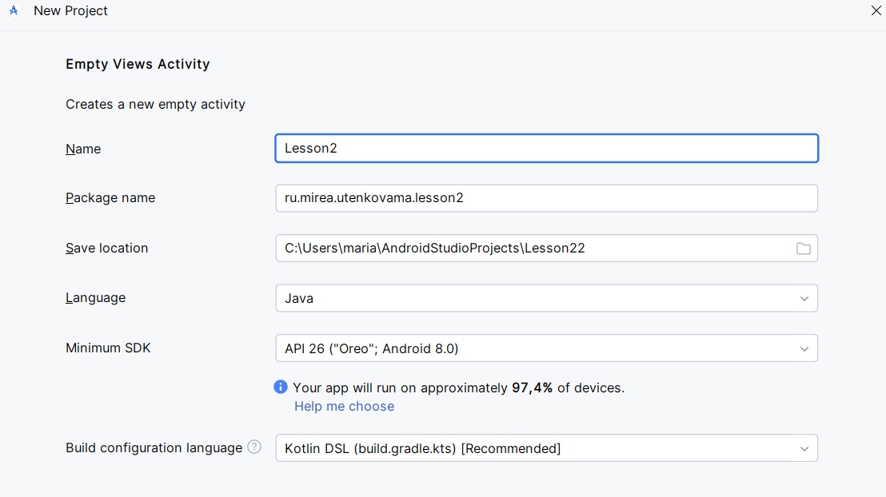
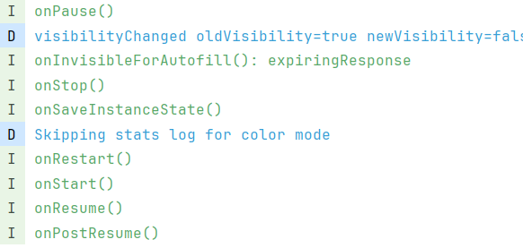
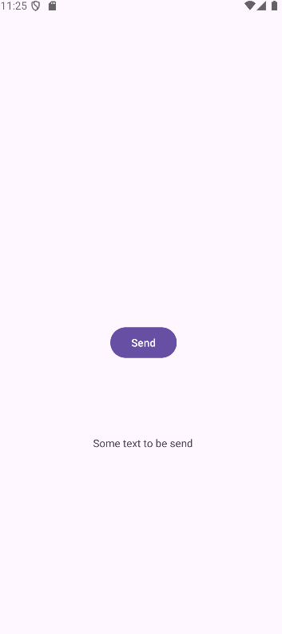

## ActivityLifecycle
Создан проект Lesson2, в нем создан модуль ActivityLifecycle.




Переопределены методы с добавлением логирования:


Создано текстовое поле для ввода "EditText"


Приложение запущено:


Сообщения из окна LogCat:


Введен текст в поле:


Вопросы:
1. Будет ли вызван метод "onCreate" после нажатия на кнопку "Home" и возврата в приложение?
	1. Нет, при нажатии "Home" активность переходит в фон (вызывается onPause, onStop), но не уничтожается. При возврате система вызывает onRestart, а затем onStart и onResume.
	2. 
2. Изменится ли значение поля "EditText" после нажатия на кнопку "Home" и возврата в приложение?
	1. Нет, не изменится. Система автоматически сохраняет состояние пользовательского интерфейса (включая текст в EditText), когда активность переходит в фон, и восстанавливает при возврате.
3. Изменится ли значение поля "EditText" после нажатия на кнопку "Back" и возврата в приложение?
	1. Нет, аналогично "Home".
	2. 

## MultiActivity
Создан модуль MultiActivity


Создана кнопка: 


Создание новой активности:


Создана новая активность:


Добавлена кнопка:


В activity_second.xml добавлен элемент TextView


Добавлено поле для ввода


MainActivity.java


SecondActivity.java


Введен текст:


После нажатия на кнопку:



Приложение отработало корректно.

Logcat:


## IntentFilter

Создание модуля «IntentFilter»


MainActivity.java


activity_main.xml


Программа после запуска:


При нажатии на кнопку "Интернет"


При нажатии на кнопку "Текст"


## ToastApp

Создание модуля «ToastApp»


activity_main.xml


MainActivity.java


Приложение:


## NotificationApp

Создание модуля NotificationApp:


Создана кнопка:


Добавлена информация о требуемых разрешениях:


MainActivity.java:


Запрашивается разрешение на отправку уведомлений:


При нажатии на кнопку появляется уведомление:


Создание модуля Dialog

Создана кнопка:


MainActivity.java


При нажатии на кнопку темнеет окно:


Создание диалогового окна с тремя кнопками:


Добавлено закрытие диалога при нажатии на кнопку:


При нажатии на кнопку появляется диалог:


При выборе одного из вариантов появляется сообщение с соответствующим текстом:

## Самостоятельная работа

Создание модуля для самостоятельной работы:


Интерфейс программы:

MainActivity.java:

MainActivity.java
```
package ru.mirea.utenkovama.samrab;  
  
import android.os.Bundle;  
import java.util.Calendar;  
import android.widget.TextView;  
import android.app.ProgressDialog;  
import android.app.TimePickerDialog;  
import android.os.Handler;  
import android.view.View;  
import androidx.activity.EdgeToEdge;  
import androidx.appcompat.app.AppCompatActivity;  
import androidx.core.graphics.Insets;  
import androidx.core.view.ViewCompat;  
import androidx.core.view.WindowInsetsCompat;  
import android.os.Message;  
import android.app.DatePickerDialog;  
import android.widget.TimePicker;  
import android.widget.DatePicker;  
import android.text.format.DateUtils;  
  
public class MainActivity extends AppCompatActivity {  
    Calendar dateAndTime = Calendar.getInstance();  
    TextView currentDateTime;  
    ProgressDialog progressDialog;  
    Handler handler;  
  
    @Override  
    protected void onCreate(Bundle savedInstanceState) {  
        super.onCreate(savedInstanceState);  
        EdgeToEdge.enable(this);  
        setContentView(R.layout.activity_main);  
        ViewCompat.setOnApplyWindowInsetsListener(findViewById(R.id.main), (v, insets) -> {  
            Insets systemBars = insets.getInsets(WindowInsetsCompat.Type.systemBars());  
            v.setPadding(systemBars.left, systemBars.top, systemBars.right, systemBars.bottom);  
            return insets;  
        });  
    }  
  
    public void onClickShowDialog(View view) {  
        progressDialog = new ProgressDialog(this);  
        progressDialog.setMax(100);  
        progressDialog.setMessage("Идет загрузка...");  
        progressDialog.setTitle("Пример работы ProgressDialog");  
        progressDialog.setProgressStyle(ProgressDialog.STYLE_HORIZONTAL);  
        progressDialog.show();  
  
        handler = new Handler() {  
            public void handleMessage(Message msg) {  
                if (progressDialog.getProgress() < progressDialog.getMax()) {  
                    progressDialog.incrementProgressBy(20);  
                    handler.sendEmptyMessageDelayed(0, 500);  
                } else {  
                    // когда шкала заполнилась, диалог пропадает  
                    progressDialog.dismiss();  
                }  
            }  
        };  
        handler.sendEmptyMessageDelayed(0, 1000);  
  
    }  
    public void setDate(View v) {  
        new DatePickerDialog(MainActivity.this, d,  
                dateAndTime.get(Calendar.YEAR),  
                dateAndTime.get(Calendar.MONTH),  
                dateAndTime.get(Calendar.DAY_OF_MONTH))  
                .show();  
    }  
  
  
    public void setTime(View v) {  
        new TimePickerDialog(MainActivity.this, t,  
                dateAndTime.get(Calendar.HOUR_OF_DAY),  
                dateAndTime.get(Calendar.MINUTE), true)  
                .show();  
    }  
  
    TimePickerDialog.OnTimeSetListener t=new TimePickerDialog.OnTimeSetListener() {  
        public void onTimeSet(TimePicker view, int hourOfDay, int minute) {  
            dateAndTime.set(Calendar.HOUR_OF_DAY, hourOfDay);  
            dateAndTime.set(Calendar.MINUTE, minute);  
            setInitialDateTime();  
        }  
    };  
    DatePickerDialog.OnDateSetListener d=new DatePickerDialog.OnDateSetListener() {  
        public void onDateSet(DatePicker view, int year, int monthOfYear, int dayOfMonth) {  
            dateAndTime.set(Calendar.YEAR, year);  
            dateAndTime.set(Calendar.MONTH, monthOfYear);  
            dateAndTime.set(Calendar.DAY_OF_MONTH, dayOfMonth);  
            setInitialDateTime();  
        }  
    };  
    private void setInitialDateTime() {  
  
        currentDateTime.setText(DateUtils.formatDateTime(this,  
                dateAndTime.getTimeInMillis(),  
                DateUtils.FORMAT_SHOW_DATE | DateUtils.FORMAT_SHOW_YEAR  
                        | DateUtils.FORMAT_SHOW_TIME));  
    }  
  
}
```

Прогресс-диалог:


Выбор времени:


Время установлено:


Выбор даты:


Дата изменена:


